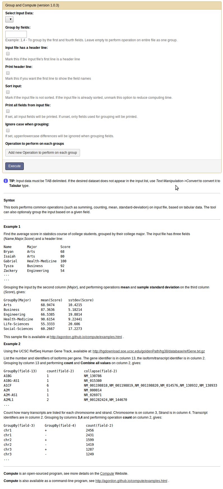

### compute in Galaxy

[Galaxy](http://usegalaxy.org/) is an open, web-based platform for accessible, reproducible, and transparent computational biomedical research. In **Galaxy**, the `compute` can be used directly from a web-browser, without installing the program or typing commands on the terminal.

To try the `compute` tool in Galaxy, visit the [Compute Demo Galaxy Server](http://computedemo.teamerlich.org/).

### Installing Compute Tool in a Galaxy Server

**Compute** is available in the [Galaxy Tool Shed](https://wiki.galaxyproject.org/Tool%20Shed) as the [computer_wrapper](http://toolshed.g2.bx.psu.edu/repository/manage_repository?changeset_revision=e91a07e82d96&id=bbd7c087721da534) repository.

#### Compute Tool Options in Galaxy

The `compute` tool in galaxy provides a web-interface for all the command line options:

